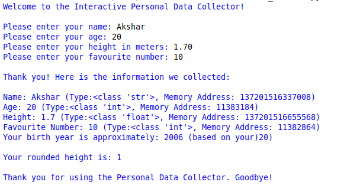

# 🚀 Python Fundamental Booster

## 📌 Project Overview

An interactive Python console application that collects user information and demonstrates Python fundamentals including input, data types, memory addresses, arithmetic operations, and type conversion.

This project was built to practice the basics of Python programming while creating a simple and interactive command-line application.

---

## 📸 Output Screenshot



---

## 🔄 Flowchart

```text
Start
  │
  ▼
Display Welcome Message
  │
  ▼
Get Name
  │
  ▼
Get Age
  │
  ▼
Get Height
  │
  ▼
Get Favourite Number
  │
  ▼
Display User Information
  │
  ▼
Calculate Birth Year
  │
  ▼
Round Height
  │
  ▼
Display Goodbye Message
  │
  ▼
End
```

---

## ✨ Features

- Interactive user input
- Displays data types using `type()`
- Displays memory addresses using `id()`
- Calculates approximate birth year
- Rounds height to an integer
- Beginner-friendly Python program

---

## 🛠️ Technologies Used

- Python 3

---

## 📂 Project Structure

```text
Python_Fundamental_Booster/
│
├── Fundamental_Booster.py
├── README.md
└── Screenshots/
    └── Python_Fundamental_Booster_Output.png
```

---

## ▶️ Run

```bash
python Fundamental_Booster.py
```

---

## 📚 Concepts Practiced

- Variables
- User Input
- Strings
- Integers
- Floats
- Type Casting
- `type()`
- `id()`
- Arithmetic Operations
- Output Formatting

---

## 🎯 What I Learned

While building this project, I practiced:

- Taking user input
- Working with different Python data types
- Using built-in functions like `type()` and `id()`
- Performing basic calculations
- Formatting console output
- Writing clean and readable Python code

---

⭐ Thank you for checking out my project!
